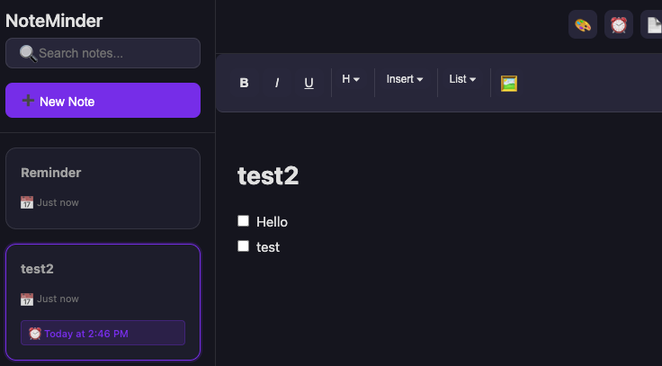

# NoteMinder

A beautiful, minimalist note-taking app that lives on the edge of your screen with smart reminders.

## Screenshots


*Task list management with checkboxes*

## Features

- **Edge-Docked Interface**: Stays on the right edge of your screen, always accessible
- **Collapsible Sidebar**: Click the arrow tab to expand/collapse the notes list
- **Rich Text Editor**: Full formatting support including:
  - Bold, italic, underline
  - Headings (H1, H2, H3)
  - Lists (bullet, numbered, task lists)
  - Code blocks and inline code
  - Blockquotes
  - Links and images
  - Drag & drop image support
- **Smart Reminders**: Set one-time, daily, or weekly reminders for your notes
- **Color Coding**: Customize note backgrounds with color themes
- **Search**: Quickly find notes with instant search
- **Import/Export**: Import markdown files and export notes as JSON
- **Themes**: Dark and light theme support
- **Always on Top**: Stays visible across all workspaces (macOS)
- **Click-Through**: When collapsed, clicks pass through to apps behind it

## Installation

### Download Pre-built Releases

Download the latest version for your platform from the [Releases page](https://github.com/hypn05/NoteMinder/releases):

- **macOS**: Download `NoteMinder-X.X.X-arm64.dmg` (Apple Silicon) or `NoteMinder-X.X.X.dmg` (Intel)
  - Open the DMG file
  - Drag NoteMinder to your Applications folder
  - Right-click and select "Open" the first time (macOS security)
  
- **Windows**: Download `NoteMinder-Setup-X.X.X.exe`
  - Run the installer
  - Follow the installation wizard
  - Launch from Start Menu or Desktop shortcut
  
- **Linux**: Download `NoteMinder-X.X.X.AppImage`
  - Make it executable: `chmod +x NoteMinder-X.X.X.AppImage`
  - Run: `./NoteMinder-X.X.X.AppImage`

### From Source

1. Clone the repository
2. Install dependencies:
   ```bash
   npm install
   ```
3. Run the app:
   ```bash
   npm start
   ```

### Build Distribution

Build for your platform:

```bash
# macOS
npm run build -- --mac

# Windows
npm run build -- --win

# Linux
npm run build -- --linux

# All platforms
npm run build
```

## Usage

### Basic Operations

- **Create Note**: Click the "➕ New Note" button or use the tray menu
- **Edit Note**: Click on a note card to open it in the editor
- **Delete Note**: Hover over a note card and click the 🗑️ icon
- **Search**: Type in the search box to filter notes

### Formatting

Use the toolbar buttons to format your text:
- **B/I/U**: Bold, italic, underline
- **H**: Insert headings (H1, H2, H3)
- **Insert**: Add code, code blocks, blockquotes, or links
- **List**: Create bullet lists, numbered lists, or task lists
- **🖼️**: Insert images

### Reminders

1. Click the ⏰ button on a note card or in the editor header
2. Choose reminder type:
   - **One-time**: Set a specific date and time
   - **Daily**: Repeats every day at the specified time
   - **Weekly**: Repeats on a specific day of the week
3. Add an optional message
4. Click "Set Reminder"

### Customization

- **Background Color**: Click the 🎨 button to choose a color for the current note
- **Theme**: Right-click the tray icon → Theme → Dark/Light
- **Stay in View**: Right-click the tray icon → Stay in View (prevents auto-collapse)

### Import/Export

- **Import Markdown**: Click the 📄 button to import a .md file
- **Export Notes**: Right-click the tray icon → Export Notes
- **Import Notes**: Right-click the tray icon → Import Notes

## Architecture

The app is built with a clean, reusable component structure:

### Components
- **Modal**: Reusable modal dialog component
- **Editor**: Rich text editor with formatting capabilities
- **NoteCard**: Note preview card with actions

### Utilities
- **Storage**: JSON file-based storage manager
- **ReminderManager**: Handles reminder scheduling and notifications

### Styles
- **variables.css**: CSS custom properties for theming
- **components.css**: Reusable component styles
- **main.css**: Application-specific styles

## Data Storage

Notes and settings are stored locally in JSON files:
- **macOS**: `~/Library/Application Support/NoteMinder/`
- **Windows**: `%APPDATA%/NoteMinder/`
- **Linux**: `~/.config/NoteMinder/`

## Creating a Release

To create a new versioned release with builds for all platforms:

1. Ensure all changes are committed
2. Run the release script:
   ```bash
   ./scripts/release.sh
   ```
3. Follow the prompts to:
   - Set the new version number (e.g., 1.0.1)
   - Build for all platforms (macOS, Windows, Linux)
   - Create a git tag
   - Push changes to GitHub

4. Upload release assets to GitHub:
   - Go to the [Releases page](https://github.com/hypn05/NoteMinder/releases)
   - Click "Draft a new release"
   - Select the newly created tag
   - Upload the build files from `releases/vX.X.X/`
   - Add release notes
   - Publish the release

### Using GitHub CLI (Optional)

If you have [GitHub CLI](https://cli.github.com/) installed, you can create the release automatically:

```bash
gh release create v1.0.1 releases/v1.0.1/* \
  --title "NoteMinder v1.0.1" \
  --notes "Release notes here"
```

## Development

### Project Structure

```
noteMinder/
├── main.js              # Electron main process
├── renderer.js          # Renderer process logic
├── index.html           # Main HTML structure
├── components/          # Reusable UI components
│   ├── modal.js
│   ├── editor.js
│   └── noteCard.js
├── utils/              # Utility modules
│   ├── storage.js
│   └── reminder.js
├── styles/             # CSS files
│   ├── variables.css
│   ├── components.css
│   └── main.css
└── build/              # App icons and resources
```

### Key Technologies

- **Electron**: Cross-platform desktop app framework
- **Node.js**: JavaScript runtime
- **CSS Variables**: For theming support
- **ContentEditable**: For rich text editing

## License

MIT License - feel free to use and modify as needed.

## Credits

Built with ❤️ using Electron and modern web technologies.
