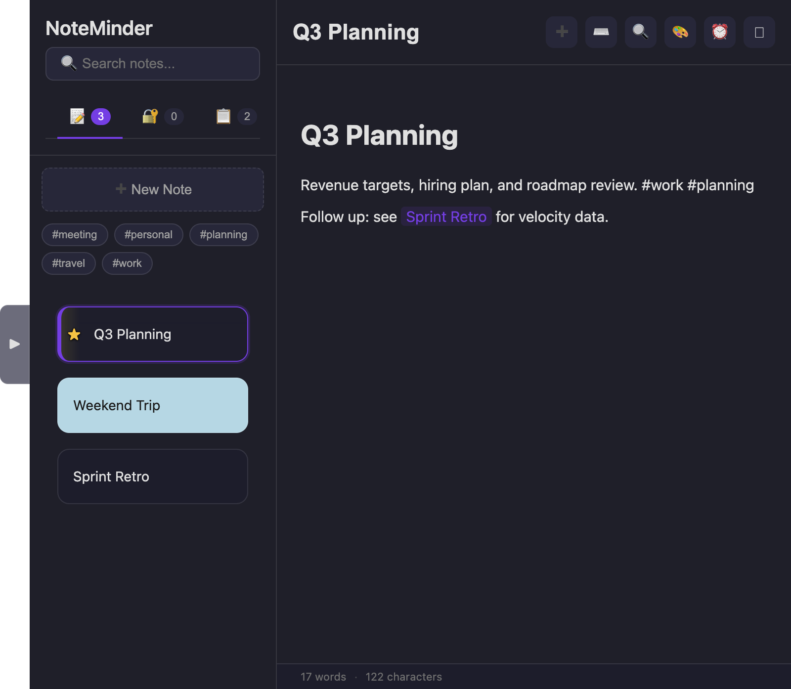
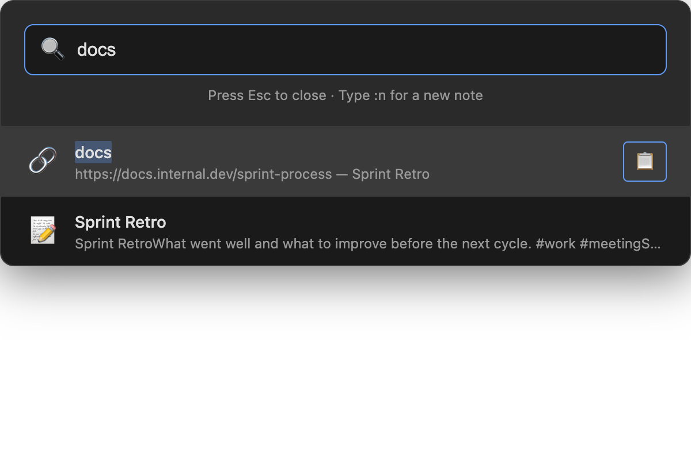
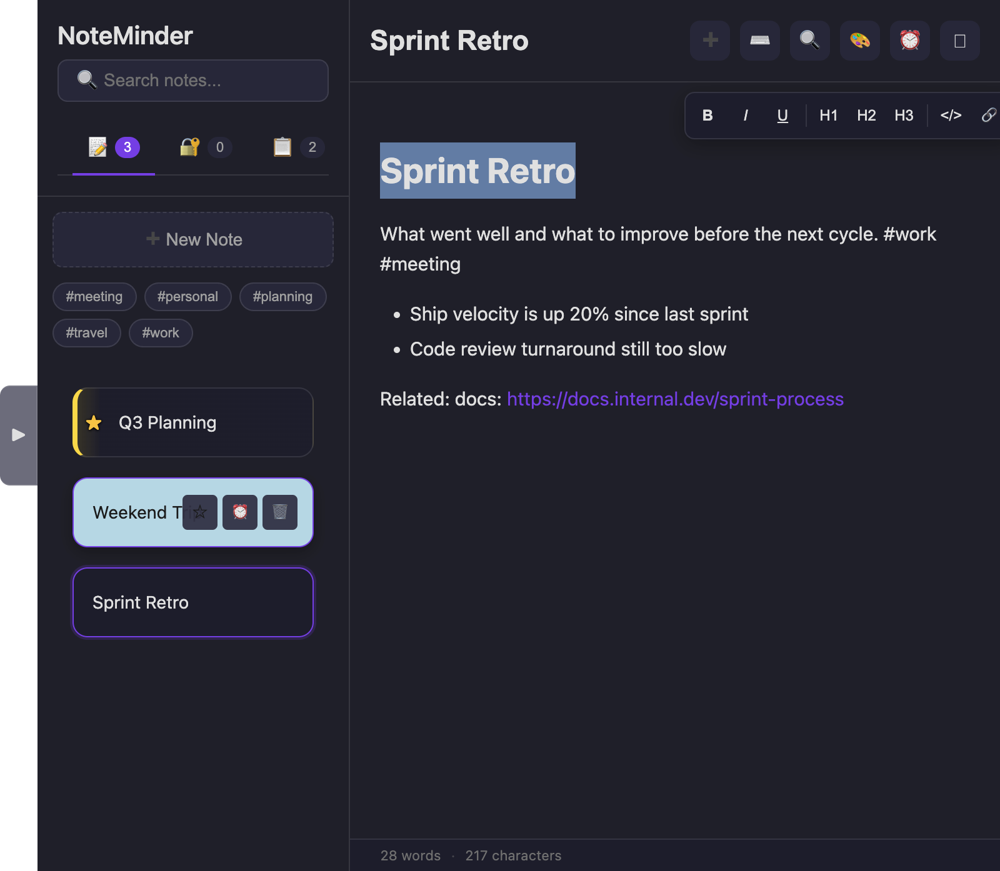
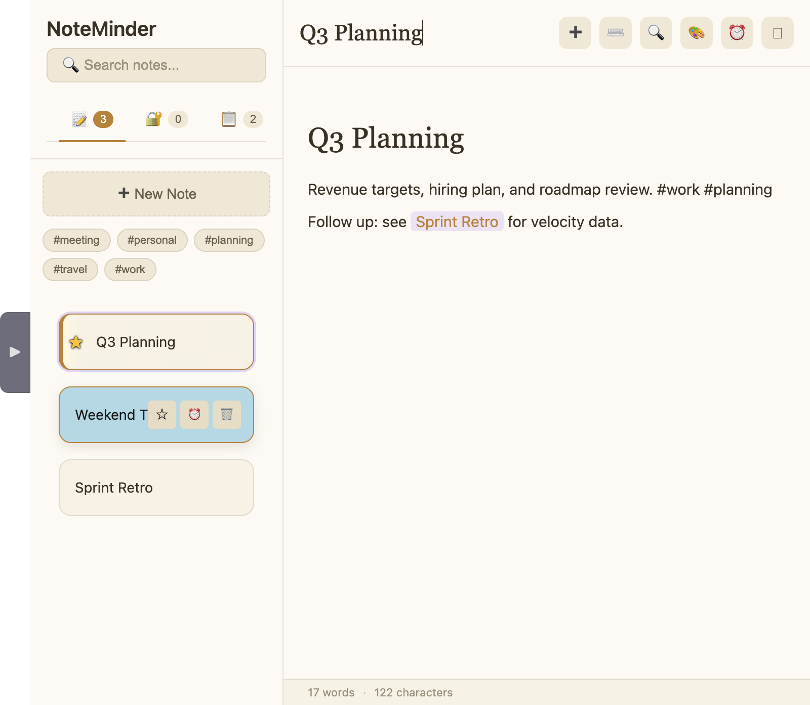
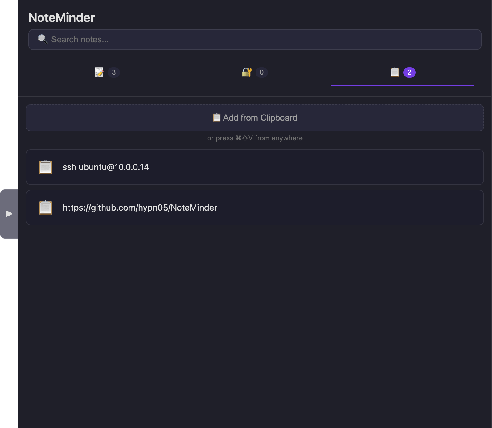

# NoteMinder

A floating, keyboard-first notes app for macOS, Windows, and Linux. It docks to the edge of your
screen, gets out of the way, and comes back with `⌘⇧Space` from anywhere.

[**Try it →**](https://hypn05.github.io/NoteMinder/) · [Download the latest release](https://github.com/hypn05/NoteMinder/releases/latest)



## Features

- **Spotlight-style search** — `⌘⇧Space` opens a search palette from any app, on any desktop. It searches notes, passwords, clips, and links, and `:n` creates a new note without touching the mouse.
- **Quick-copy links** — write `docs: https://…` (or select text before inserting a link) and it becomes its own searchable result. Search for it, hit Enter, and the URL is on your clipboard — no need to open the note.
- **Wiki-style note linking** — type `[[` to link one note to another with live autocomplete; it creates the note if it doesn't exist yet.
- **Tags** — write `#tag` anywhere in a note and it becomes a clickable filter in the sidebar.
- **Dock / undock** — pop the app out into a normal, resizable window when you want it, and dock it back to the screen edge with one click.
- **Clips** — `⌘⇧V` saves whatever's on your clipboard, from any app, as a searchable clip you can grab again later.
- **Smart reminders** — one-time, daily, or weekly alerts on any note, with native notifications.
- **Password vault** — encrypted password entries alongside your notes, unlocked with Touch ID.
- **Rich text editor** — a floating formatting toolbar appears only when you select text (bold, italic, underline, headings, code, links), plus markdown-style shortcuts (`#`, `-`, `**bold**`, etc.) as you type.
- **Color-coded notes**, **markdown import/export**, and a built-in keyboard shortcuts cheat sheet (`⌘/`).
- **Dark, Light, or Paper theme** — same features, different mood.

## Installation

### macOS

#### Option 1: Homebrew (recommended)

```bash
brew install hypn05/noteminder/noteminder
```

**Note:** on first run, if you see an "app is damaged" error:
```bash
sudo xattr -cr /Applications/NoteMinder.app
```

#### Option 2: Direct download

1. Download from [Releases](https://github.com/hypn05/NoteMinder/releases/latest):
   - Apple Silicon: `NoteMinder-X.X.X-arm64.dmg`
   - Intel: `NoteMinder-X.X.X.dmg` (no `-arm64` suffix)
2. Open the DMG and drag NoteMinder to Applications.
3. Right-click the app and select "Open" (first time only).

### Windows

1. Download `NoteMinder.Setup.X.X.X.exe` from [Releases](https://github.com/hypn05/NoteMinder/releases/latest).
2. Run the installer and follow the wizard.
3. Launch from the Start Menu or the desktop shortcut.

### Linux

1. Download `NoteMinder-X.X.X-arm64.AppImage` from [Releases](https://github.com/hypn05/NoteMinder/releases/latest).
2. Make it executable and run it:
   ```bash
   chmod +x NoteMinder-X.X.X-arm64.AppImage
   ./NoteMinder-X.X.X-arm64.AppImage
   ```

## Usage

### Search, anywhere



Press `⌘⇧Space` (`Ctrl⇧Space` on Windows/Linux) from any app to open search. It's one flat list of
notes, links, passwords, and clips:

| Key | Action |
|---|---|
| `:n` | Create a new note |
| `↵` | Open a note, or copy a link/clip/password |
| `⌘⇧V` | Save the current clipboard contents as a searchable clip |
| `Esc` | Close the search window |

### Formatting



Select text and a small floating toolbar appears with Bold, Italic, Underline, headings, code, and
links — nothing takes up space until you need it. Everything else (images, tables, dividers) lives
in the `+` Insert menu. You can also type markdown as you go: `# ` for a heading, `- ` for a bullet,
`**bold**`, `` `code` ``, and so on.

- `#tag` anywhere in a note becomes a clickable filter in the sidebar.
- `[[` starts a note link with live autocomplete; pick an existing note or create a new one on the fly.
- Press `⌘/` at any time for the full keyboard shortcuts reference.

### Reminders

1. Click the ⏰ icon on a note card.
2. Choose One-time, Daily, or Weekly.
3. Set a date/time and an optional message.
4. Click "Set Reminder".

### Dock and undock

Click the 🗗 button to pop the note window out into an ordinary, resizable window — useful when
you want more room or need to move it to another display. Click it again to dock the app back to
the edge of your screen.

### Customization



- **Color**: click 🎨 on a note to give it a background color.
- **Theme**: right-click the tray icon → Theme → Dark, Light, or Paper.
- **Stay in View**: right-click the tray icon → Stay in View.

### Import / export

- **Import markdown**: open the ➕ Insert menu → Import Markdown.
- **Export/import notes**: right-click the tray icon.

### Clips



Press `⌘⇧V` from any app to save whatever's on your clipboard as a clip. Clips show up in search
and in their own tab, so you can grab something you copied earlier without digging through your
clipboard history.

## Updates

### Homebrew
```bash
brew upgrade noteminder
```

### Direct download
The app checks for updates automatically and notifies you when a new version is available.

---

## For developers

### Setup

```bash
# Clone repository
git clone https://github.com/hypn05/NoteMinder.git
cd NoteMinder

# Install dependencies
npm install

# Run app
npm start
```

### Development

```bash
# Run in development mode
npm start

# Build for current platform
npm run build

# Build for a specific platform
npm run build -- --mac
npm run build -- --win
npm run build -- --linux
```

### Project structure

```
NoteMinder/
├── main.js             # Electron main process — windows, IPC, tray, shortcuts
├── renderer.js         # Main window UI logic
├── search-renderer.js  # Spotlight-style search window logic
├── index.html          # Main window
├── search.html         # Search window
├── components/         # UI components (editor, note cards)
├── utils/               # Storage, reminders, auto-updater
├── styles/              # CSS, including theme variables
└── build/               # Icons, entitlements, packaging resources
```

### Creating a release

```bash
./scripts/release.sh
```

This prompts for a version number, then:
- updates the version in `package.json`,
- builds for macOS (Intel + ARM), Windows, and Linux,
- creates a git tag and pushes to GitHub,
- creates a GitHub release with the built installers,
- updates the Homebrew formula, if the `homebrew-noteminder` tap exists alongside this repo.

### Data storage

Notes are stored locally, under the app's package name (lowercase):
- **macOS**: `~/Library/Application Support/noteminder/`
- **Windows**: `%APPDATA%/noteminder/`
- **Linux**: `~/.config/noteminder/`

### Technologies

- **Electron** — desktop framework
- **Node.js** — JavaScript runtime
- **CSS custom properties** — theming (Dark/Light/Paper)
- **contenteditable** — rich text editing

## License

MIT License

## Credits

Built with ❤️ using Electron.
