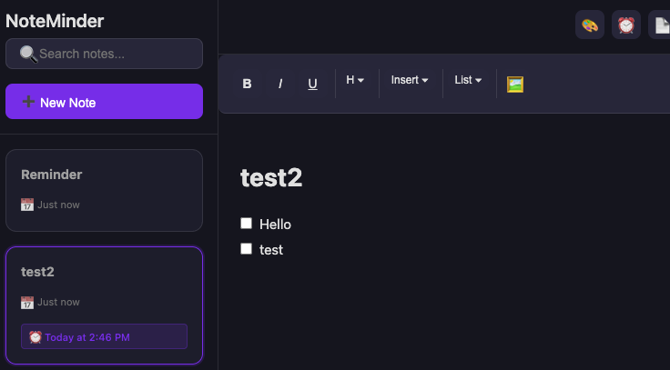

# NoteMinder

A beautiful, minimalist note-taking app that lives on the edge of your screen with smart reminders.



## Features

- **Edge-Docked Interface**: Stays on the right edge of your screen, always accessible
- **Collapsible Sidebar**: Click the arrow tab to expand/collapse the notes list
- **Rich Text Editor**: Full formatting support (bold, italic, headings, lists, code, links, images)
- **Smart Reminders**: Set one-time, daily, or weekly reminders for your notes
- **Color Coding**: Customize note backgrounds with color themes
- **Search**: Quickly find notes with instant search
- **Import/Export**: Import markdown files and export notes as JSON
- **Themes**: Dark and light theme support
- **Always on Top**: Stays visible across all workspaces

## Installation

### macOS

#### Option 1: Homebrew (Recommended)

```bash
brew install hypn05/noteminder/noteminder
```

**Note:** On first run, if you see "app is damaged" error:
```bash
sudo xattr -cr /Applications/NoteMinder.app
```

#### Option 2: Direct Download

1. Download from [Releases](https://github.com/hypn05/NoteMinder/releases):
   - Apple Silicon: `NoteMinder-X.X.X-arm64.dmg`
   - Intel: `NoteMinder-X.X.X.dmg`
2. Open the DMG and drag NoteMinder to Applications
3. Right-click the app and select "Open" (first time only)

### Windows

1. Download `NoteMinder-Setup-X.X.X.exe` from [Releases](https://github.com/hypn05/NoteMinder/releases)
2. Run the installer and follow the wizard
3. Launch from Start Menu or Desktop shortcut

### Linux

1. Download `NoteMinder-X.X.X.AppImage` from [Releases](https://github.com/hypn05/NoteMinder/releases)
2. Make it executable:
   ```bash
   chmod +x NoteMinder-X.X.X.AppImage
   ```
3. Run it:
   ```bash
   ./NoteMinder-X.X.X.AppImage
   ```

## Usage

### Basic Operations

- **Create Note**: Click "➕ New Note" button
- **Edit Note**: Click on a note card
- **Delete Note**: Hover over note and click 🗑️
- **Search**: Type in the search box to filter notes

### Formatting

Use the toolbar to format text:
- **B/I/U**: Bold, italic, underline
- **H**: Headings (H1, H2, H3)
- **Insert**: Code blocks, blockquotes, links
- **List**: Bullets, numbers, task lists
- **🖼️**: Insert images

### Reminders

1. Click ⏰ on a note card
2. Choose type: One-time, Daily, or Weekly
3. Set date/time and optional message
4. Click "Set Reminder"

### Customization

- **Color**: Click 🎨 to choose note background color
- **Theme**: Right-click tray icon → Theme → Dark/Light
- **Stay in View**: Right-click tray icon → Stay in View

### Import/Export

- **Import Markdown**: Click 📄 button
- **Export/Import Notes**: Right-click tray icon

## Updates

### Homebrew
```bash
brew upgrade noteminder
```

### Direct Download
The app checks for updates automatically. You'll be notified when a new version is available.

---

## For Developers

### Setup

```bash
# Clone repository
git clone https://github.com/hypn05/NoteMinder.git
cd NoteMinder

# Install dependencies
npm install

# Run app
npm start
```

### Development

```bash
# Run in development mode
npm start

# Build for current platform
npm run build

# Build for specific platform
npm run build -- --mac
npm run build -- --win
npm run build -- --linux
```

### Project Structure

```
noteMinder/
├── main.js              # Electron main process
├── renderer.js          # Renderer process logic
├── index.html           # Main HTML
├── components/          # UI components
│   ├── editor.js
│   └── noteCard.js
├── utils/              # Utilities
│   ├── storage.js
│   ├── reminder.js
│   └── autoUpdater.js
├── styles/             # CSS files
└── build/              # App resources
```

### Creating a Release

```bash
# Run release script
./scripts/release.sh

# Follow prompts to:
# 1. Set version number
# 2. Build all platforms
# 3. Create git tag
# 4. Push to GitHub
# 5. Create GitHub release (requires gh CLI)
```

The script automatically:
- Updates version in package.json
- Builds for macOS (Intel + ARM), Windows, and Linux
- Creates git tag and pushes to GitHub
- Creates GitHub release with commit messages
- Updates Homebrew formula (if tap exists)

### Distribution

See these guides for detailed setup:
- [HOMEBREW_SETUP.md](HOMEBREW_SETUP.md) - Homebrew tap setup
- [MACOS_GATEKEEPER_FIX.md](MACOS_GATEKEEPER_FIX.md) - Fixing unsigned app issues
- [DISTRIBUTION_SUMMARY.md](DISTRIBUTION_SUMMARY.md) - Complete distribution guide

### Data Storage

Notes are stored locally:
- **macOS**: `~/Library/Application Support/NoteMinder/`
- **Windows**: `%APPDATA%/NoteMinder/`
- **Linux**: `~/.config/NoteMinder/`

### Technologies

- **Electron** - Desktop framework
- **Node.js** - JavaScript runtime
- **CSS Variables** - Theming
- **ContentEditable** - Rich text editing

## License

MIT License

## Credits

Built with ❤️ using Electron
